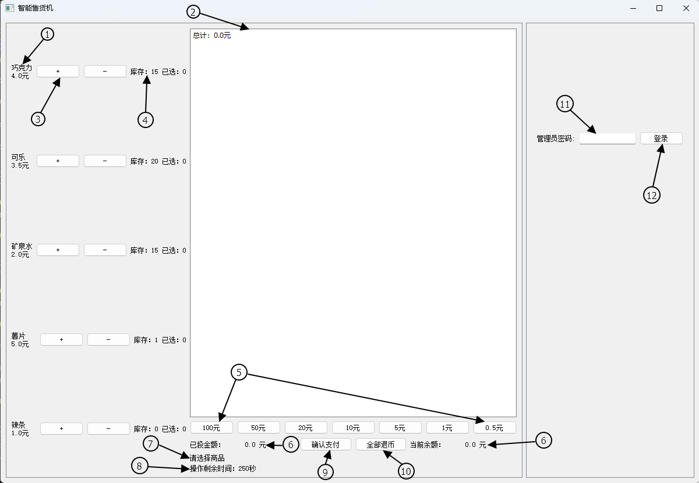
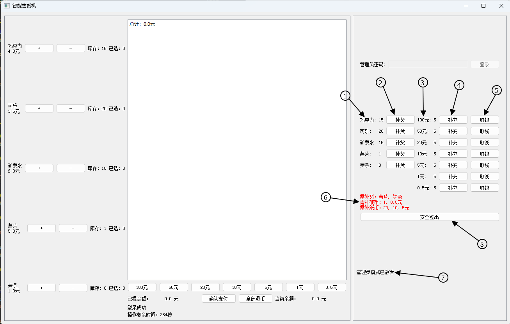

# Vending machine user manual
## Environment setup
### Python vesion
Commonly any version newer than Python 3.9.x can work
Recommended Python 3.11.5

### Required libraries
For users, please make sure you have installed PyQt5, if not, run following command in powershell.
pip install PyQt5
If you want to run tests, please make sure you have installed pyzmq.
pip install pyzmq

## UI introductions
### User interface

Components:
1: Product list. Show what the vending machine is selling and their price. Price is shown below the name of the product. In our vending machine for example, it sell chocolates and one for 4 yuan.
2: Cart list. Show what product you have selected and the sum of their prices. Once a product is selected, it will be added to the cart list and its price will be added to the sum.
3: "+" button and "-" button. Each product have a "+" button and "-" button on its right side. Click "+" button means select this product to your cart. Click "-" button means deselect this product from your cart.
4: Inventory and the number of selected products. This part is shown on the right side of the "-" button, and it shows how many products you can buy at most and how many products you have selected.
5: Coin buttons and bill buttons. These buttons is places under the cart list, and click them means users insert the corresponding amount of money, for example, click 100yuan button means user insert 100 yuan.
6: Inserted money and current amount. These are acutally the same, means how much money the user has left in the vending machine. If user insert x yuan, inserted money and current amount will add x. Since our implementation allows users to repeatedly select goods and purchases with sufficient money, if user completes a purchase, these amounts will be subtracted from the inserted money and current amount.
7: Status label. Show infos and operations results, like "successfully purchase".
8: Timer label. Show remaining operation time. It only limits the interval between each successful operation to 5 minutes. It will be reset after every operations that successfully completed. If time goes to 0, the vending machine will clean the cart list, the inserted money and current amount. If vending machine is in admin mode, it will automatically log out when time goes to 0.
9: Purchase. After selecting products and inserting enough money, click this button to complete one purchase. If purchase failed, reasons will be shown in the Status label.
10: Refund. After all operations are completed, click this button to get your changes back. If falied, reasons will be shown in the Status label.
11: Password entry. A blank text box, used to enter password to enter admin mode.
12: Login button. After entering correct password in entry, click login button to enter admin mode. If you login successfully, infos of login success will be displayed on Status label. Otherwise, infomation of login failed will be displayed.

### Admin interface

Changes:
1: The password entry and login button is not available.
2: The admin panel is visible.

Components:
1: Product list. Show what the vending machine is selling and their stock.
2: Add product button. Each product in product list have an add product button on the right side. Click the button means the admin restock this product. If current amount is less than 20, restock to 20. 
3: Money list. Show the amount of storage for each money that the vending machine accepts.
4: Add coin/bill button. Each money has a refill button on the right side of money list. Click the button means refill the storage of each money. If current amount is less than the setting threshold, restock to threshold. Otherwise, do nothing.
5: Withdraw button. Each money has a withdraw button on the right side of the refill button. Click the button means withdraw money. If current amount is greater than the setting threshold, withdraw the money that exceeds the threshold. Otherwise, do nothing.
6: Alert label. There are 4 kinds of alert label, need to restock product, need to refill coin, need to refill bill and full cash. Each has its trigger condition, for example, if product amount is less than 5, it will trigger restock alert.
7: Admin status label. Show the infos after successful admin operations, like refill bill succeed.
8: Logout button. After finishing all operations in admin mode, admin should logout back to user mode to prevent users from using features that are not within the user's access, which may cause risk and loss.
