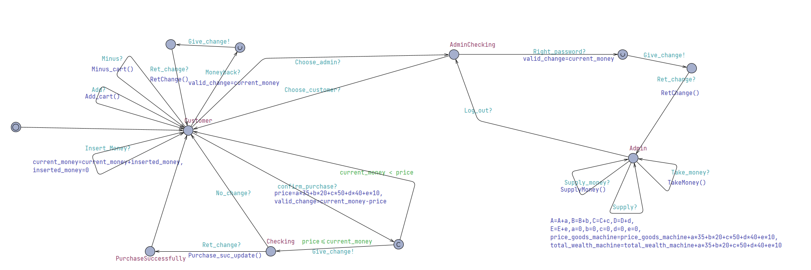
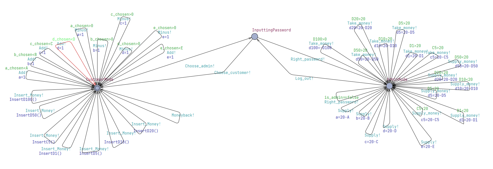
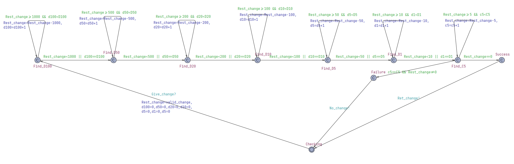
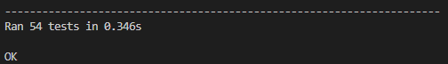
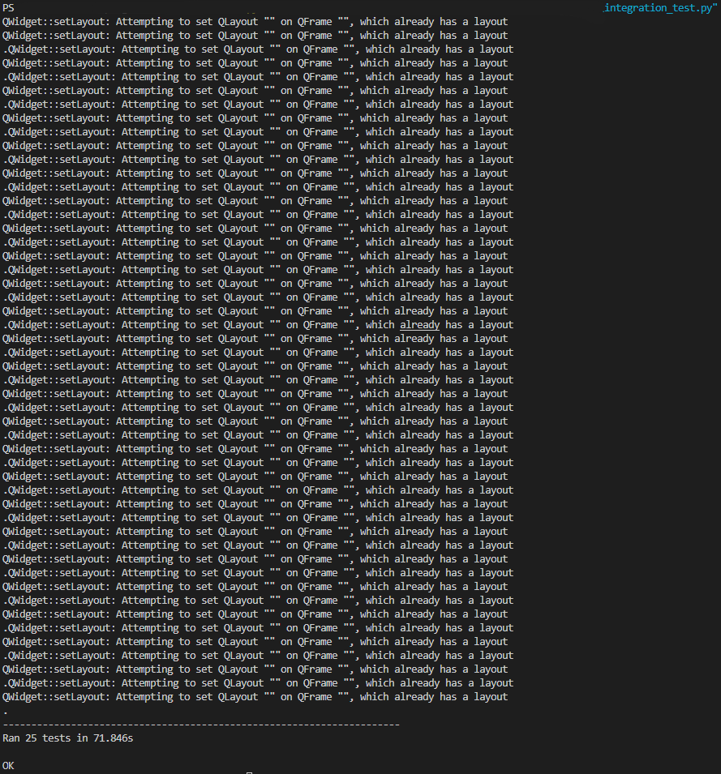
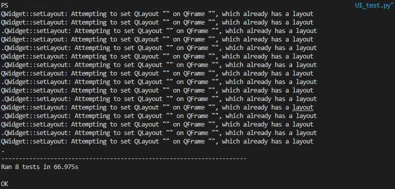

## Testing
If you want to run the test files, run following commands in Code/testing:
python Unittests.py
python integration_test.py
python UI_test.py
If you want to run API, run following commands:
in Code/testing, run python API_test.py
in your server part, run main.py
If you want to directly run the system, run following command in Code/system:
python run.py
### Unit tests
Tests lists:

| Test id |           Function name           |
| :-----: | :-------------------------------: |
| T1.1.1  |         test_add_to_cart          |
| T1.1.2  |       test_add_to_cart_fail       |
| T1.1.3  |     test_add_to_cart_invalid      |
| T1.2.1  |       test_remove_from_cart       |
| T1.2.2  |    test_remove_from_cart_fail     |
| T1.2.3  |   test_remove_from_cart_remain    |
| T1.2.4  |   test_remove_from_cart_invalid   |
| T1.3.1  |   test_process_payment_success    |
| T1.3.2  | test_process_payment_insufficient |
| T1.3.3  |  test_process_payment_not_refund  |
| T1.3.4  |  test_process_payment_no_product  |
| T1.4.1  |          test_refund_all          |
| T1.4.2  |     test_refund_all_no_money      |
| T1.5.1  |       test_can_give_change        |
| T1.6.1  |        test_check_timeout         |
| T1.6.2  | test_check_timeout_product_remain |
| T1.6.3  |  test_check_timeout_money_remain  |
| T1.7.1  |         test_verify_admin         |
| T1.8.1  |         test_refill_coins         |
| T1.8.2  |   test_refill_coins_sufficient    |
| T1.9.1  |        test_withdraw_coins        |
| T1.9.2  |  test_withdraw_coins_sufficient   |
| T1.9.3  |    test_withdraw_coins_invalid    |
| T1.10.1 |         test_insert_coin          |
| T1.10.2 |     test_insert_invalid_coin      |
| T1.11.1 |       test_restock_products       |
| T1.11.2 |   test_restock_invalid_products   |
| T2.1.1  |     test_insert_coin_binding      |
| T2.1.1  |     test_insert_coin_binding      |
| T2.2.1  |     test_refill_coin_binding      |
| T2.3.1  |       test_withdraw_binding       |
| T2.4.1  |    test_check_timeout_diaplay     |
| T2.4.2  |     test_check_timein_diaplay     |
| T2.4.3  |  test_check_timein_diaplay_admin  |
| T2.5.1  |        test_update_display        |

#### VM.py

```python
def add_to_cart(self, product_idx):
    if product_idx not in [0, 1, 2, 3, 4]:
        return False
    product = self.products[product_idx]
    if product.stock > 0 and (product.stock > self.selected_products[product_idx]):
        self.selected_products[product_idx] += 1
        self.last_operation_time = time.time()
        return True
    return False
```

TC1.1.1: invalid_product_index -> product_idx not in [0, 1, 2, 3, 4]
TC1.1.2: valid_product_index -> product_idx in [0, 1, 2, 3, 4]
TC1.1.3: add_to_cart_failed -> product.stock <= 0 or (product.stock <= self.selected_products[product_idx])
TC1.1.4: add_to_cart_succeeded -> product.stock > 0 and (product.stock > self.selected_products[product_idx])

|                |      T1.1.1      |      T1.1.2      | T1.1.3  |
| :------------: | :--------------: | :--------------: | :-----: |
| Coverage items | TC1.1.2, TC1.1.4 | TC1.1.2, TC1.1.3 | TC1.1.1 |

branch coverage = 100%

```python
def remove_from_cart(self, product_idx):
    if product_idx not in [0, 1, 2, 3, 4]:
        return False
    if product_idx in self.selected_products:
        self.selected_products[product_idx] -= 1
        if self.selected_products[product_idx] <= 0:
            del self.selected_products[product_idx]
        self.last_operation_time = time.time()
        return True
    return False
```

TC1.2.1: remove_valid_product -> product_idx in [0, 1, 2, 3, 4]
TC1.2.2: remove_invalid_product -> product_idx not in [0, 1, 2, 3, 4]
TC1.2.3: product_selected -> product_idx in self.selected_products
TC1.2.4: product_not_selected ->product_idx not in self.selected_products
TC1.2.5: selected_products_sub_to_0 -> matched by T1.2.1 test_remove_from_cart
TC1.2.6: selected_products_sub -> matched by T1.2.3 test_remove_from_cart_remain

|                |          T1.2.1           |      T1.2.2      |          T1.2.3           | T1.2.4  |
| :------------: | :-----------------------: | :--------------: | :-----------------------: | :-----: |
| Coverage items | TC1.2.1, TC1.2.3, TC1.2.5 | TC1.2.1, TC1.2.4 | TC1.2.1, TC1.2.3, TC1.2.6 | TC1.2.2 |

branch coverage = 100%

```python
def process_payment(self):
    total = self.calculate_total()
    self.last_operation_time = time.time()
    if total == 0:
        return False, {}, "请先选购商品"
    if self.current_amount < total:
        return False, {}, f"金额不足，还需{total - self.current_amount:.1f}元"
  
    change = self.current_amount - total
    if change > 0 and not self.can_give_change(change):
        return False, {}, "零钱不足，请先退币"
  
    self.current_amount -= total
    for idx, qty in self.selected_products.items():
        self.products[idx].stock -= qty

    success_msg = f"支付成功！当前余额：{self.current_amount:.1f}元"
    raw_products = dict(self.selected_products)
    self.selected_products.clear()
    products = {idx + 1: qty for idx, qty in raw_products.items() if qty > 0}
    return True, products, success_msg
```

TC1.3.1: product_not_selected -> total == 0
TC1.3.2: product_selected -> total != 0
TC1.3.3: insert_amount_insufficient -> self.current_amount < total
TC1.3.4: insert_amount_sufficient -> self.current_amount >= total
TC1.3.5: change_insufficient -> change > 0 and not self.can_give_change(change)
TC1.3.6: purchase_succeeded -> change > 0 and self.can_give_change(change)

|                |          T1.3.1           |      T1.3.2      |          T1.3.3           | T1.3.4  |
| :------------: | :-----------------------: | :--------------: | :-----------------------: | :-----: |
| Coverage items | TC1.3.2, TC1.3.4, TC1.3.6 | TC1.3.2, TC1.3.3 | TC1.3.2, TC1.3.4, TC1.3.5 | TC1.3.1 |

branch coverage = 100%

```python
def refund_all(self):
    self.last_operation_time = time.time()
    if self.current_amount == 0:
        return {}, "当前没有可退金额"
  
    actual_refund, change_result = self.give_change(self.current_amount)
    self.current_amount = 0
    return change_result, f"退币成功！退还：{actual_refund:.1f}元"
```

TC1.4.1: no_refund_amount -> self.current_amount == 0
TC1.4.2: refund_succeeded -> self.current_amount > 0

|                | T1.4.1  | T1.4.2  |
| :------------: | :-----: | :-----: |
| Coverage items | TC1.4.2 | TC1.4.1 |

branch coverage = 100%

```python
def can_give_change(self, amount):
    temp_stock = self.coin_stock.copy()
    for coin in self.valid_coins:
        temp_stock[coin] += self.insert_stock[coin]
    remaining = amount
    for coin in self.valid_coins:
        if remaining <= 0.05:
            return True
        count = min(remaining // coin, temp_stock[coin])
        remaining -= count * coin
    return remaining <= 0.05
```

TC1.5.1: can_give_change -> remaining <= 0.05
TC1.5.2: cannot_give_change -> remaining > 0.05

|                |      T1.5.1      |
| :------------: | :--------------: |
| Coverage items | TC1.5.1, TC1.5.2 |

branch coverage = 100%

```python
def give_change(self, amount):
    for coin in self.valid_coins:
        self.coin_stock[coin] += self.insert_stock[coin]
        self.insert_stock[coin] = 0
    remaining = amount
    change_given = 0
    change_result = {coin: 0 for coin in self.valid_coins}
    for coin in self.valid_coins:
        if remaining <= 0:
            break
        count = min(remaining // coin, self.coin_stock[coin])
        if count > 0:
            self.coin_stock[coin] -= count
            remaining -= count * coin
            change_given += count * coin
            change_result[coin] = int(count)
    return change_given, change_result
```

TC1.6.1: give_changes -> remaining <= 0
TC1.6.2: searching_changes -> remaining > 0
TC1.6.3: have_required_coins -> count > 0
TC1.6.4: no_required_coins -> count <= 0
TC1.6.4 will not be covered. Never happened since the setting of insert_stock and function of can_give_change

|                |               T1.4.1               |
| :------------: | :--------------------------------: |
| Coverage items | TC1.6.1, TC1.6.2, TC1.6.3, TC1.6.4 |

branch coverage = 75%

```python
def check_timeout(self):
    need_clear = (time.time() - self.last_operation_time) > self.timeout
    if need_clear:
        if self.selected_products:
            self.selected_products.clear()
        if self.current_amount > 0:
            for coin in self.valid_coins:
                self.coin_stock[coin] += self.insert_stock[coin]
                self.insert_stock[coin] = 0
            self.current_amount = 0
    return need_clear
```

TC1.7.1: time_in -> (time.time() - self.last_operation_time) <= self.timeout
TC1.7.2: time_out -> (time.time() - self.last_operation_time) > self.timeout
TC1.7.3: products_remained -> self.selected_products not empty
TC1.7.4: no_products_remained -> self.selected_products empty
TC1.7.5: money_remained -> self.current_amount > 0
TC1.7.6: no_money_remained -> self.current_amount <= 0

|                | T1.3.1  |          T1.6.1           |          T1.6.2           |          T1.6.3           |
| :------------: | :-----: | :-----------------------: | :-----------------------: | :-----------------------: |
| Coverage items | TC1.7.1 | TC1.7.2, TC1.7.4, TC1.7.6 | TC1.7.2, TC1.7.3, TC1.7.6 | TC1.7.2, TC1.7.4, TC1.7.5 |

branch coverage = 100%

```python
def verify_admin(self, input_pwd):
    if input_pwd == self.admin_password:
        return True
    return False
```

TC1.8.1: password_correct -> input_pwd == self.admin_password
TC1.8.2: password_wrong -> input_pwd != self.admin_password

|                |      T1.7.1      |
| :------------: | :--------------: |
| Coverage items | TC1.8.1, TC1.8.2 |

branch coverage = 100%

```python
def refill_coin(self, coin):
    if coin in self.valid_coins:
        if self.coin_stock[coin] < self.coin_threshold[coin]:
            self.coin_stock[coin] = self.coin_threshold[coin]
    else: 
        return False
    self.check_alerts()
    return True
```

TC1.9.1: refill_valid -> coin in self.valid_coins
TC1.9.2: refill_invalid -> coin not in self.valid_coins
TC1.9.3: refill_coin_stock_sufficient -> self.coin_stock[coin] >= self.coin_threshold[coin]
TC1.9.4: refill_coin_stock_insufficient -> self.coin_stock[coin] < self.coin_threshold[coin]

|                |          T1.8.1           |      T1.8.2      |
| :------------: | :-----------------------: | :--------------: |
| Coverage items | TC1.9.1, TC1.9.2, TC1.9.4 | TC1.9.1, TC1.9.3 |

branch coverage = 100%

```python
def withdraw_coin(self, coin):
    if coin in self.valid_coins: 
        if self.coin_stock[coin] > self.coin_threshold[coin]:
            self.coin_stock[coin] = self.coin_threshold[coin]
    else:
        return False
    self.check_alerts()
    return True
```

TC1.10.1: withdraw_valid_coins -> coin in self.valid_coins
TC1.10.2: withdraw_invalid_coins -> coin not in self.valid_coins
TC1.10.3: withdraw_coin_stock_sufficient -> self.coin_stock[coin] > self.coin_threshold[coin]
TC1.10.4: withdraw_coin_stock_insufficient -> self.coin_stock[coin] <= self.coin_threshold[coin]

|                |       T1.9.1       |       T1.9.2       |  T1.9.3  |
| :------------: | :----------------: | :----------------: | :------: |
| Coverage items | TC1.10.1, TC1.10.4 | TC1.10.1, TC1.10.3 | TC1.10.2 |

branch coverage = 100%

```python
def insert_coin(self, coin):
    if coin in self.valid_coins:
        self.current_amount += coin
        self.insert_stock[coin] += 1
        self.last_operation_time = time.time()
```

TC1.11.1: insert_valid_coins -> coin in self.valid_coins
TC1.11.2: insert_invalid_coins -> coin not in self.valid_coins

|                | T1.10.1  | T1.10.2  |
| :------------: | :------: | :------: |
| Coverage items | TC1.11.1 | TC1.11.2 |

branch coverage = 100%

```python
def restock_product(self, product_idx):
    if product_idx not in [0, 1, 2, 3, 4]:
        return False
    product = self.products[product_idx]
    product.stock = 20
    self.check_alerts()
    return True
```

TC1.12.1: restock_valid_products -> product_idx in [0, 1, 2, 3, 4]
TC1.12.2: restock_invalid_products -> product_idx not in [0, 1, 2, 3, 4]

|                | T1.11.1  | T1.11.2  |
| :------------: | :------: | :------: |
| Coverage items | TC1.12.1 | TC1.12.2 |

branch coverage = 100%

#### UI.py

```python
def setup_user_interface(self):
    ...
    control_layout = QVBoxLayout()
    self.cart_list = QListWidget()
    control_layout.addWidget(self.cart_list)

    coin_row = QHBoxLayout()
    for coin in self.vm.valid_coins:
        btn = QPushButton(f"{coin}元")
        if coin in [1, 0.5]:
            btn.clicked.connect(lambda _, c=coin: self.send_request(f"insert_coin@{c}"))
        else:
            btn.clicked.connect(lambda _, c=coin: self.send_request(f"insert_bill@{c}"))
        coin_row.addWidget(btn)
    control_layout.addLayout(coin_row)
    ...
```

TC2.1.1: insert_coin_connect -> coin in [1, 0.5]
TC2.1.2: insert_bill_connect -> coin not in [1, 0.5]

|                |      T2.1.1      |
| :------------: | :--------------: |
| Coverage items | TC2.1.1, TC2.1.2 |

branch coverage = 100%

```python
def setup_admin_interface(self):
    ...
    self.coin_labels = {}
    for i, coin in enumerate(sorted(self.vm.valid_coins, reverse=True)):
        label = QLabel(f"{coin}元:")
        count_label = QLabel(str(self.vm.coin_stock[coin]))
        refill_btn = QPushButton("补充")
        refill_btn.setObjectName(f"refill_{coin}")
        if coin in [1, 0.5]:
            refill_btn.clicked.connect(lambda _, c=coin: self.send_request(f"add_coin@{c}"))
        else:
            refill_btn.clicked.connect(lambda _, c=coin: self.send_request(f"add_bill@{c}"))
        withdraw_btn = QPushButton("取钱")
        withdraw_btn.setObjectName(f"withdraw_{coin}")
        if coin in [1, 0.5]:
            withdraw_btn.clicked.connect(lambda _, c=coin: self.send_request(f"remove_coin@{c}"))
        else:
            withdraw_btn.clicked.connect(lambda _, c=coin: self.send_request(f"remove_bill@{c}"))
        stock_group.addWidget(label, i, 3)
        stock_group.addWidget(count_label, i, 4)
        stock_group.addWidget(refill_btn, i, 5)
        stock_group.addWidget(withdraw_btn, i, 6)
        self.coin_labels[coin] = count_label
    ...
```

TC2.2.1: add_coin_connect -> coin in [1, 0.5]
TC2.2.2: add_bill_connect -> coin not in [1, 0.5]
TC2.2.3: remove_coin_connect -> coin in [1, 0.5]
TC2.2.4: remove_bill_connect -> coin not in [1, 0.5]

|                |      T2.2.1      |      T2.3.1      |
| :------------: | :--------------: | :--------------: |
| Coverage items | TC2.2.1, TC2.2.2 | TC2.2.3, TC2.2.4 |

branch coverage = 100%

```python
def check_timeout(self):
    if self.vm.check_timeout():
        if self.state:
            self.logout_succeeded()
        self.update_display()
    remaining = self.vm.timeout - (time.time() - self.vm.last_operation_time)
    self.user_timer_label.setText(f"操作剩余时间：{max(0, int(remaining))}秒")
```

TC2.3.1：time_in_display -> not self.vm.check_timeout()
TC2.3.2: time_out_display -> self.vm.check_timeout()
TC2.3.3: in admin mode -> self.state
TC2.3.4: in user mode -> not self.state

|                |      T2.4.1      | T2.4.2  |      T2.4.3      |
| :------------: | :--------------: | :-----: | :--------------: |
| Coverage items | TC2.3.2, TC2.3.3 | TC2.3.1 | TC2.3.2, TC2.3.4 |

branch coverage = 100%

```python
def update_display(self):
    ...
    alerts = []
    self.vm.check_alerts()
    if self.vm.alerts["low_stock"]:
        alerts.append(f"需补货：{', '.join(self.vm.alerts['low_stock'])}")
    if self.vm.alerts["low_coins"]:
        alerts.append(f"需补硬币：{', '.join(map(str, self.vm.alerts['low_coins']))}元")
    if self.vm.alerts["low_bills"]:
        alerts.append(f"需补纸币：{', '.join(map(str, self.vm.alerts['low_bills']))}元")
    if self.vm.alerts["full_cash"]:
        alerts.append(f"需取钱：{', '.join(map(str, self.vm.alerts['full_cash']))}元")
    self.alert_label.setText("\n".join(alerts))

    if self.admin_panel.isVisible():
        self.admin_panel.repaint()
```

TC2.4.1: low_stock_alert -> self.vm.alerts["low_stock"]
TC2.4.2: no_low_stock_alert -> not self.vm.alerts["low_stock"]
TC2.4.3: low_coin_alert -> self.vm.alerts["low_coins"]
TC2.4.4: no_low_coin_alert -> not self.vm.alerts["low_coins"]
TC2.4.5: low_bill_alert -> self.vm.alerts["low_bills"]
TC2.4.6: no_low_bill_alert -> not self.vm.alerts["low_bills"]
TC2.4.7: full_cash_alert -> self.vm.alerts["full_cash"]
TC2.4.8: no_full_cash_alert -> not self.vm.alerts["full_cash"]

|                |                                 T1.5.1                                 |
| :------------: | :--------------------------------------------------------------------: |
| Coverage items | TC2.4.1, TC2.4.2, TC2.4.3, TC2.4.4, TC2.4.5, TC2.4.6, TC2.4.7, TC2.4.8 |

branch coverage = 100%

Remaining unit tests are functional tests:
vm functional tests: test_check_alerts
ui functional tests: starts with test_login_succeed and ends with test_user_failed

Overall we have 58 branches in my vending machine coding, and we match 57 of them, branch coverage is 98.3%.
The only one we didn't not match is TC1.6.4: no_required_coins, and we prevent it from happenning through functIon can_give_change(self) in vm, called by process_payment(self) in vm and data structure insert_stock in vm.
The former function helps vm determine whether it can make changes, if it can't it will refund the inserted coins.
The latter structure stores insert coins and it will not be added into coin_stock until purchase is successful or timeout.

### Integration tests

#### Input Partition

vaild inputs:

- TCOND1：insert_coin@i for i in [1, 0.5]
- TCOND2：insert_bill@i for i in [100, 50, 20, 10, 5]
- TCOND3：select_product@i for i in [1, 2, 3, 4, 5] and vm.prodcuts[i].stock > 0
- TCOND4：deselect_product@i for i in [1, 2, 3, 4, 5] and vm.selected_products[i] > 0
- TCOND5：purchase for sufficient inserted money and can give change
- TCOND6: refund_all for remaining money in vm
- TCOND7：login@123456
- TCOND8：logout in admin mode
- TCOND9：add_product@i for i in [1, 2, 3, 4, 5] in admin mode
- TCOND10：add_coin@i for i in [1, 0.5] in admin mode
- TCOND11：add_bill@i for i in [100, 50, 20, 10, 5] in admin mode
- TCOND12：remove_coin@i for i in [1, 0.5] in admin mode
- TCOND13：remove_bill@i for i in [100, 50, 20, 10, 5] in admin mode

invaild inputs:

- TCOND14: insert_coin@i for i not in [1, 0.5]
- TCOND15: insert_bill@i for i not in [100, 50, 20, 10, 5]
- TCOND16：insert_coin in admin mode
- TCOND17：insert_bill in admin mode
- TCOND18: select_product@i for i not in [1, 2, 3, 4, 5]
- TCOND19: select_product@i for i in [1, 2, 3, 4, 5] and vm.prodcuts[i].stock <= 0
- TCOND20: select product in admin mode
- TCOND21: deselect_product@i for i not in [1, 2, 3, 4, 5]
- TCOND22：deselect_product@i for i in [1, 2, 3, 4, 5] and vm.selected_products[i] <= 0
- TCOND23: deselect product in admin mode
- TCOND24: refund_all for no remaining money in vm
- TCOND25: refund_all in admin mode
- TCOND26: purchase for sufficient inserted money but can't give change
- TCOND27：purchase for insufficient inserted money
- TCOND28：purchase for no selected products
- TCOND29：purchase in admin mode
- TCOND30: login@wrong password
- TCOND31: login in admin mode
- TCOND32：logout in user mode
- TCOND33：add_product@i for i not in [1, 2, 3, 4, 5]
- TCOND34：add_product@i in user mode
- TCOND35：add_coin@i for i not in [1, 0.5]
- TCOND36：add_coin@i in user mode
- TCOND37：add_bill@i for i not in [100, 50, 20, 10, 5]
- TCOND38：add_bill@i in user mode
- TCOND39：remove_coin@i for i not in [1, 0.5]
- TCOND40：remove_coin@i in user mode
- TCOND41：remove_bill@i for i not in [100, 50, 20, 10, 5]
- TCOND42：remove_bill@i in user mode

#### Output Partition

- TCOND43: 投币成功 induced by TCOND1, TCOND2
- TCOND44: 请先退出管理员模式 induced by TCOND16, TCOND17, TCOND20, TCOND23, TCOND25, TCOND29
- TCOND45: 商品已添加 induced by TCOND3
- TCOND46: 商品选择失败 induced by TCOND19
- TCOND47: 商品已移除 induced by TCOND4
- TCOND48: 商品移除失败 induced by TCOND22
- TCOND49: 当前没有可退金额 induced by TCOND24
- TCOND50: 退币成功！退还：money元 induced by TCOND6
- TCOND51: 支付成功！当前余额：money元 induced by TCOND5
- TCOND52: 请先选购商品 induced by TCOND28
- TCOND53: 金额不足，还需money元 induced by TCOND27
- TCOND54: 零钱不足，请先退币 induced by TCOND26
- TCOND55: 登陆成功in user panel 管理员模式已激活in admin panel induced by TCOND7
- TCOND56: 登陆失败，请重试 induced by TCOND30
- TCOND57: 请选择商品 induced by TCOND8
- TCOND58: 商品补货成功 induced by TCOND9
- TCOND59: 钱币补充成功 induced by TCOND10
- TCOND60: 钞票补充成功 induced by TCOND11
- TCOND61: 已取钱 induced by TCOND12, TCOND13
- TCOND62: 请先进入管理员模式 induced by TCOND32, TCOND34, TCOND36, TCOND38, TCOND40, TCOND42

|                  Function name                  |           TCOND covered            |
| :---------------------------------------------: | :--------------------------------: |
|       def test_login_admin_success(self)        |  TCOND7, TCOND55, TCOND2, TCOND6   |
|        def test_login_admin_failed(self)        |          TCOND29, TCOND56          |
|           def test_logout_admin(self)           |          TCOND8, TCOND57           |
| def test_admin_restock_product_succeeded(self)  |          TCOND9, TCOND58           |
|   def test_admin_restock_product_falied(self)   |          TCOND34, TCOND62          |
|   def test_admin_refill_coin_succeeded(self)    | TCOND10, TCOND11, TCOND59, TCOND60 |
|     def test_admin_refill_coin_falied(self)     |     TCOND36, TCOND38, TCOND62      |
|     def test_admin_withdraw_succeeded(self)     |     TCOND12, TCOND13, TCOND61      |
|      def test_admin_withdraw_falied(self)       |     TCOND40, TCOND42, TCOND62      |
|   def test_insert_coin_button_succeeded(self)   |      TCOND1, TCOND2, TCOND43       |
|    def test_insert_coin_button_failed(self)     |     TCOND16, TCOND17, TCOND44      |
|      def test_return_money_succeeded(self)      |          TCOND6, TCOND50           |
|  def test_return_money_failed_no_refund(self)   |          TCON24, TCOND49           |
|    def test_return_money_failed_admin(self)     |          TCOND25, TCOND44          |
|      def test_select_product_success(self)      |          TCOND3, TCOND45           |
| def test_select_product_failed_no_product(self) |          TCOND19, TCOND46          |
|  def test_select_product_failed_in_admin(self)  |          TCOND20, TCOND44          |
|     def test_deselect_product_success(self)     |          TCOND4, TCOND47           |
| def test_deselect_product_fail_no_product(self) |          TCOND22, TCOND48          |
|  def test_deselect_product_fail_in_admin(self)  |          TCOND23, TCOND44          |
|         def test_purchase_success(self)         |          TCOND5, TCOND51           |
| def test_purchase_fail_insufficient_funds(self) |          TCOND27, TCOND53          |
|     def test_purchase_fail_no_change(self)      |          TCOND26, TCOND54          |
|   def test_purchase_fail_in_admin_mode(self)    |          TCOND29, TCOND44          |
|       def test_purchase_no_product(self)        |          TCOND28, TCOND52          |

All testcases come from integration_test.py. We cover 51 TCONDs in all 62 TCONDs and the overall coverage is 82.26%. Those uncovered TCONDs are 14, 15, 18, 21, 31, 32, 33, 35, 37, 39, 41. All of them are out of range inputs like invalid insert money, invalid product index. These TCONDs can't be tested through UItest since we actually don't give such button. In API test, these API instructions will return false.

### System tests

#### Common workflows

For customers:

- Operation 1: Select product that he/she wants and available by clicking the "+" button on the right side of the product. The selected product will be displayed in cart list.
- Operation 2: Insert enough money. The amount of money will be displayed in the left down part of the panel.
- Operation 3: Click purchase button
- Operation 4: Click refund button
Operation 1 and Operation 2 are in no particular order. After Operation 3, customers can go back to Operation 1 and buy more things.
Also, customers can deselect product by  clicking the "-" button on the right side of "+" button.
The time between each operation should be less than 300 seconds. Once the time is larger than 300 seconds, the cart list will be cleaned and the remaining money will not be returned.

For managers:

- Operation 1: Log in and enter the admin mode.
- Operation 2: Refill coins or bills.
- Operation 3: Restore products.
- Operation 4: Withdraw coins or bills.
- Operation 5: Log out.
Operation 2, Operation 3 and Operation 4 are in no particular order.

#### Rare workflows

Step:

- Insert 100
- Add product 0
- Log in
- withdraw 100
- purchase
  Links to the admin withdraw. For our implement, every withdraw operation is same to change the number in coin_stock. Thus there may be such circumstance: customer inserts some 100, then admin log in and withdraw 100, then customer will lose all 100 and he cannot refund.
  Our first mitigation is to refund first if login succeed. Then customer cannot purchase after admin log out. They must insert coin again; thus we have our second mitigation: add insert_stock to restore the inserted money, and only after purchase and time out it will be added into coin_stock.
  Also, it tests that in commom case customer can get right change and right product.
  testcase(UItest.py):

```python
def test_rare1(self)
```

Step

- Empty coin_stock(set the base environment)
- Insert 100
- Add product 0
- purchase
  Links to the coins/bills are not restocked.
  testcase(UItest.py):

```python
def test_rare2(self)
```

Step

- Insert 100
- Add product 4
- purchase
  Links to the products are not restocked.
  testcase(UItest.py):

```python
def test_rare3(self)
```

Step

- Log in
- Insert 100
- Wait for 300s
  Links to admin forgot to log out.
  testcase(UItest.py):

```python
def test_rare4(self)
```

## Model checking

### System Model



The model behave the same except that(the abstraction and simplification)
1. We simplified it that in administration mode it will not send alarm  when :
    - there exists any product less than 5 (not enough)
    - the amount of some kind of money(except 100) in the machine is less than the set value in the development.
    - the amount of some kind of money(except 100) in the machine is more than the set value in the development.
2. We abstract the money by multiple it by 10 for calculation convenience.


### Environment Model



And the give change method(greedy in our design):



All possible customer operations has been covered in the environment model: 
- Add products
- Minus products
- Insert money (100, 50, 20, 10, 5, 1, 0.5)
- Confirm purchase 
- Take money Back

All possible administration operations has been covered as well: 
- Choose the administration mode.
- Input right password.
- Log out.
- Supply money in the machine.
- Take the money in the machine when the amount of money is too large.


### Verification queries 

#### The queries are as follows: 
 
1. A[] not deadlock

- The purpose of this quert is to ensure our system can execute without bugs.

2. A[] total_wealth_cur==current_money+price_goods_got && total_wealth_cur>=0

The purpose of this query is to ensure the wealth that the costumer has must remain the same as the money the customer has inserted (the customer will not lose money during using machine and will not gain additional money from the machine).

3. A[] total_wealth_machine==total_money_machine+price_goods_machine-current_money && total_wealth_machine>=0

The purpose of this query is to ensure the wealth that the machine has must remain the same as it has when the administrator use it last time(the machine will not lose and money and will not take money from customer but did not give products to the customer).

4. (Process1.Checking and Process3.Success) --> Process1.PurchaseSuccessfully

The purpose of this query is to ensure that the customer will purchase successfully(gain product from machine and cost money) as long as the customer select products that has price less than the money that the customer has inserted.

5. A[] a_chosen <= A \ A[] b_chosen <= B \ A[] c_chosen <= C \ A[] d_chosen <= D \ A[] e_chosen <= E 

The purpose of this query is to ensure that the customer can only add at most the number of product that the machine has.

#### The results of queries:
When validate query 1, 2, 3, 4, 5(5 queries included) in UPPAL, it run for a long time withour counterexamples, which can be viewed as be satisfied because out in our model there will be trace that goes forever (as a user can do in the real life)
 

## Risk management

For vending machines, risks are these:

### Customer cannot get right change

- The machine may not have enough coins/bills to provide the exact change for a purchase.
- The risk will happen after purchase. If coins/bills are not restocked in appropriate time, or admin withdraws too many coins/bills, it may happen.
- It may happen occasionally if restocking properly(We assume that circumstance).
- Severity is high since it causes bad user experience, even may leads to complaints and finanicial loss.
- The overall refund process is that first check whether vm can give change(by calling function can_give_change()) based on current cart list and the amount invested during purchase. If and only if change can be made, the purchase will succeed and end this operation. Otherwise, the machine will reject the purchase and ask the customer to refund first. The above process can be repeated without affecting its functionally.

### Customer cannot get right product

- The machine may not give the correct product after purchase or may accept selection of products which has sold out.
- The risk will happen during selection and purchase. If products are not restocked in appropriate time, or the software runs wrongly, it may happen.
- It seldom happens if restocking properly(We assume that circumstance).
- Severity is high since it causes bad user experience, even may leads to complaints and finanicial loss.
- Selection will succeed only when the stock of selected product is larger than 0. Deselection will succeed only when the amount of selected products is larger than 0. Purchase will decrease the stock of products correctly and it will be displayed on the UI board.

### Admin features are not avaliable to customers

- Users (non-admin) may be able to access admin features by mistake.
- The risk will happen if admin forgot to log out or UI control wrongly exposes admin-only buttons.
- It seldom happens since it depends on code bug and the wrong operation of admin.
- Severity is very high since it causes large amount of finanicial loss.
- First only when user login successfully the admin panel will display on UI panel. All admin operations will first check whether its state is admin state. Also, we design a time check. If admin doesn't operate for larger than 300 seconds, machine will automatically logout.

### Result
Unit tests output:

Integration tests output:

System tests output:

